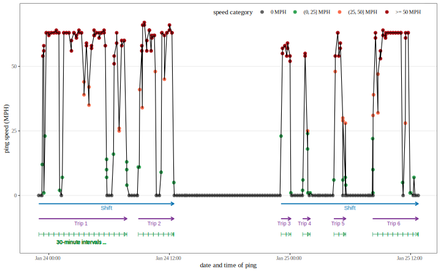

```{r, include = FALSE}
knitr::opts_chunk$set(
  collapse = TRUE,
  comment = "#>",
  out.width = "100%"
)
options(tibble.print_min = 5, tibble.print_max = 5)
```

# NDS

An R package for manipulating naturalistic driving datasets.

```{r echo=FALSE, fig.cap="NDS package separates ping data into trips, shifts, and 30-minute intervals"}

```

Generate .pdf documentation:

```{r}
file.remove("NDS.pdf")
pack = "NDS"
path = find.package(pack)
system(paste(shQuote(file.path(R.home("bin"), "R")),
    "CMD", "Rd2pdf", shQuote(path)))
```


### Problems to solve:

- [ ] Two active pings are faraway
- [ ] Vehicle stopping for a long time


### Tutorials to make an R package:

1. [Hilary Parker: Writing an R package from scratch](https://hilaryparker.com/2014/04/29/writing-an-r-package-from-scratch/),
2. [R-Mageddon: Writing an R package from scratch](https://r-mageddon.netlify.com/post/writing-an-r-package-from-scratch/),
3. [`usethis` workflow for package development](https://www.hvitfeldt.me/blog/usethis-workflow-for-package-development/#before-creation),
4. [Hadley Wickham: R Packages](http://r-pkgs.had.co.nz/).
5. [RStudio](https://support.rstudio.com/hc/en-us/articles/200486488-Developing-Packages-with-RStudio)
